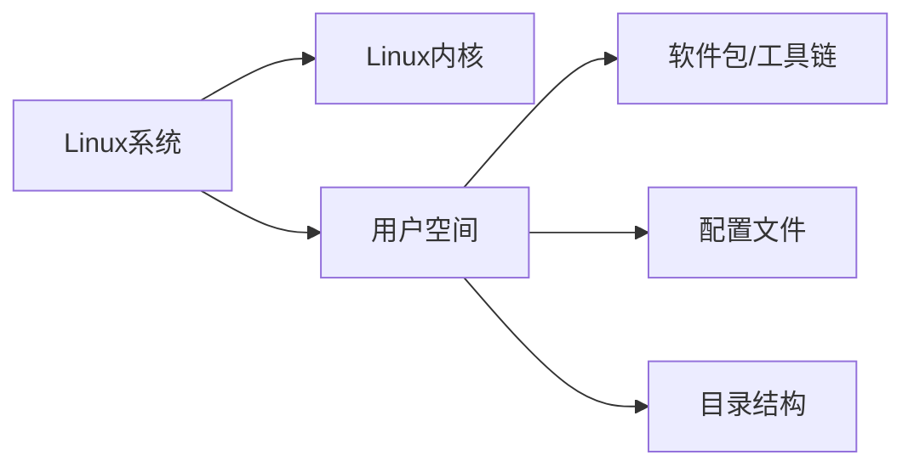
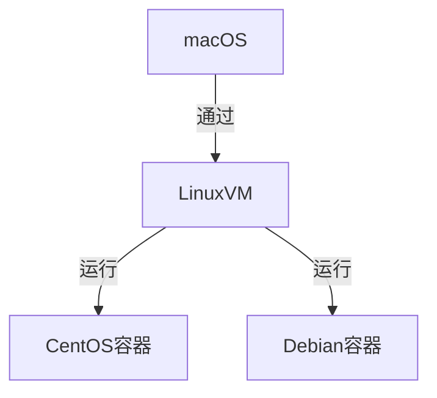

# Docker 一小时面试速览指南

## 基础概念

1. **什么是 Docker？**  

- 轻量级容器化平台，基于镜像实现应用隔离与快速部署。
- 核心组件：Docker Engine、镜像（Image）、容器（Container）。

2. **Docker VS 虚拟机**

| 特性       | Docker            | 虚拟机          |
|------------|-------------------|----------------|
| 隔离级别   | 进程级            | 系统级          |
| 启动速度   | 秒级              | 分钟级          |
| 资源占用   | 低（共享内核）    | 高（独立OS）    |


### 问题：在Mac上运行CentOS镜像，是否意味着运行了完整的CentOS操作系统？

**简短回答**：❌ 不是。Docker容器共享宿主机的Linux内核，仅运行独立的用户空间（文件系统、软件包等），并非完整操作系统。

#### 深度解析：

1. **架构差异**（Mac vs Linux容器）

macOS本身基于Unix（BSD），但Docker容器需要Linux内核。因此Mac上的Docker实际上是通过一个轻量级Linux虚拟机（如`hyperkit`）间接运行容器。
```
macOS → Docker Desktop（Linux VM）→ CentOS容器
```

2. **容器本质**

- **共享内核**：所有容器共享宿主机的Linux内核（在Mac上是共享Linux虚拟机的内核）
- **独立用户空间**：CentOS镜像仅提供：
    - `/bin`, `/lib` 等文件系统结构
    - yum包管理器等工具
    - 自己的环境变量、进程树等

3. **与虚拟机的对比**

| 特性               | Docker容器（CentOS镜像）       | 完整CentOS虚拟机       |
|--------------------|-------------------------------|-----------------------|
| 内核               | 共享宿主机/VM的Linux内核      | 独立内核              |
| 系统进程           | 仅运行指定进程（如bash）      | 完整init/systemd进程树|
| 硬件虚拟化         | 无                            | 需要模拟硬件          |
| 启动速度           | 1-2秒                         | 30秒以上             |

4. **实际验证**  

在Mac上执行：
```bash
# 启动CentOS容器
docker run -it centos:7 bash

# 容器内查看内核版本（实际是宿主机Linux VM的内核）
uname -r  
# 输出示例：5.10.47-linuxkit（非CentOS内核！）

# 查看操作系统文件
ls /etc/*release  # 显示CentOS的文件
```

#### 关键结论：
1. **不是完整OS**：容器只是"看起来像"CentOS，实际是借用宿主内核+独立文件系统的进程隔离环境。
2. **Mac的特殊性**：比Linux多了一层Linux VM的嵌套。
3. **资源占用极低**：因为不重复运行内核，CentOS容器可能只占用10MB内存（而完整虚拟机需要1GB+）。

#### 扩展思考：

**为什么能跨发行版运行**？ 

因为Linux发行版本质是"内核+用户态软件"的组合，容器只关注后者。

### 这个在 macOS 中进行的 Linux 虚拟机，为什么既能通过 image 模拟 CentOS，又能模拟 Debian？

**一句话答案**：  

📦 容器共享主机内核，只打包发行版独有的**用户空间文件**（如`/bin`、`/lib`等），而非完整操作系统。

#### 关键技术分解

1. **Linux发行版的本质构成**



- **内核（Kernel）**：唯一且共享（如Mac的Linux VM内核）
- **用户空间**：各发行版的差异所在（如CentOS用yum，Debian用apt）

2. **容器化实现原理**

- **内核层**：所有容器共用宿主机/VM的Linux内核
- **镜像层**：仅包含发行版特有的：
    - 包管理器（yum/apt）
    - 基础工具链（coreutils, bash等）
    - 配置文件（/etc/*）
    - 库文件（/lib/*）

3. **实战验证（Mac环境）**

```bash
# 同时运行CentOS和Debian容器
docker run -it --name centos centos:7 bash
docker run -it --name debian debian:11 bash

# 在各自容器中执行：
cat /etc/os-release  # 显示不同发行版信息
uname -r            # 显示相同内核版本（如5.10.47-linuxkit）
```

4. **与虚拟机的本质区别**

| 对比项        | 容器方案               | 传统虚拟机方案         |
|--------------|-----------------------|-----------------------|
| 内核         | 共享宿主机内核         | 每个VM独立内核        |
| 发行版切换   | 秒级（替换用户空间）   | 分钟级（完整OS启动）  |
| 资源占用     | CentOS+Debian≈50MB    | 需2个完整OS（2GB+）  |

#### 经典比喻
🏢 **大楼理论**：
- **内核** = 地基+钢结构（唯一且不可变）
- **用户空间** = 内部装修（CentOS是中式风格，Debian是北欧风格）
- **容器** = 随时更换装修而不影响建筑结构

#### 进阶知识

1. **内核兼容性要求**  

容器内软件必须兼容宿主机内核版本。例如：若宿主机内核是5.x，容器内不能安装需要Linux 2.6内核的遗留软件

2. **Mac/Windows的特殊性**  

通过轻量级Linux VM（如`hyperkit`）提供Linux内核支持：



3. **极端情况验证**

```bash
# 在Alpine容器（musl libc）中运行CentOS（glibc）程序会报错
docker run alpine sh -c 'apk add curl; curl https://example.com'
# 报错：程序依赖的库文件不存在
```

#### 总结
- ✅ **能模拟多发行版**：因容器只封装用户空间文件，与内核解耦
- ⚠️ **限制**：所有容器必须使用相同架构（如x86_64）和兼容内核版本
- 🔧 **调试技巧**：`docker inspect`可查看镜像的完整文件系统结构

这种设计正是Docker"一次构建，到处运行"的核心前提！

### 还是以在 macOS 上运行 Docker CentOS 镜像为例。因为 CentOS 中要完成任务，必须运行多个进程。这些进程的进行是否体现在 Mac 上进程数量的增加？

答：在Mac上，容器内的进程不会直接显示在macOS的进程列表中，但会体现在Linux虚拟机（Docker Desktop VM）的进程树中。

这种设计既保证了隔离性，又避免了宿主机进程列表被污染，这正是容器技术的精妙之处！

### 为什么这一个Docker Linux 虚拟机进程，在虚拟机的内部，变成了许多进程？进程一变多的问题。

这个问题涉及到虚拟化技术和进程隔离的核心机制，以下是深入浅出的专业解释：

---

### 为什么一个Mac上的虚拟机进程内部能衍生出多个进程？

**核心答案**：🔮 这是Linux内核的**进程树管理**和**轻量级虚拟化技术**共同作用的结果。

#### 1. 宏观视角的进程演变

```mermaid
graph TB
  A[Mac进程表] --> B[单个hyperkit进程]
  B --> C[Linux内核进程管理]
  C --> D[systemd(pid1)]
  D --> E[容器1的nginx]
  D --> F[容器2的bash]
  E --> G[nginx worker]
```

#### 2. 关键技术分解

**2.1 虚拟机的进程孵化机制**
- **hyperkit进程**（Mac可见）
    - 仅作为虚拟硬件管理者（CPU/内存/设备模拟）
    - 不直接运行业务进程，而是托管Linux内核

**2.2 Linux内核的进程管理**

```bash
# 在Linux VM内观察进程关系
pstree -p
```
输出示例：
```
systemd(1)─┬─containerd(100)───docker-containerd(101)───nginx(1001)
           └─sshd(200)───bash(201)
```

#### 3. 经典误解澄清

❌ **错误认知**："一个进程不可能包含多个子进程"  
✅ **事实**：

- hyperkit本质是**硬件模拟器**，不是进程容器
- Linux内核才是真正的进程管理者
- 类似Chrome浏览器（一个App）可管理数百个标签页进程

#### 4. 技术对比：三种虚拟化方案

| 方案                | 进程可见性               | 代表技术           | 性能损耗 |
|---------------------|------------------------|-------------------|---------|
| 传统虚拟机           | 完全隔离                | VMware/VirtualBox | 高      |
| 用户态虚拟化         | 宿主机仅见VM进程        | hyperkit/QEMU     | 中      |
| 容器                | 共享内核                | Docker            | 低      |

#### 终极答案

虚拟机进程的"一变多"本质是：
1. **硬件模拟层**（hyperkit）仅作为"翻译官"
2. **Linux内核**自然孵化进程树
3. **容器隔离**通过namespace实现视觉上的进程独立

## 核心操作

3. **常用命令**

```bash
# 镜像管理
docker pull nginx:latest      # 拉取镜像
docker build -t myapp .       # 构建镜像
docker images                 # 查看镜像

# 容器操作
docker run -d -p 80:80 nginx  # 启动容器
docker ps -a                  # 查看容器
docker exec -it <ID> bash     # 进入容器
docker stop <ID>              # 停止容器
```

4. **Dockerfile 关键指令**

```dockerfile
FROM ubuntu:20.04             # 基础镜像
WORKDIR /app                  # 工作目录
COPY . .                      # 复制文件
RUN apt-get update && \       # 执行命令
   apt-get install -y python3
EXPOSE 8080                   # 暴露端口
CMD ["python3", "app.py"]     # 启动命令
```

## 高级话题

5. **数据持久化**

- 数据卷（Volume）：

```bash
docker volume create myvol # 卷独立于容器存在，可被多个容器同时挂载
docker run -v myvol:/container/path my_image
```

- 绑定挂载（Bind Mount）：

```bash
COPY ./app /opt/app  # 静态复制应用文件

docker run -v /host/path:/container/path my_image
```

## 面试高频问题

7. **Q&A**

- **Q1: 容器退出后数据会丢失吗？**  
  → 默认会丢失，需通过卷（Volume）或绑定挂载持久化。

- **Q2: 如何优化镜像体积？**  
  → 多阶段构建、使用 Alpine 基础镜像、合并RUN指令。

- **Q3: Docker Compose 的作用？**  
  → 通过 YAML 文件定义和管理多容器应用。

- **Q4: 容器与主机如何通信？**  
  → 通过端口映射（`-p 8080:80`）或共享网络（`--network=host`）。

## 实战技巧

8. **快速验证**

```bash
# 一键清理所有停止的容器
docker container prune

# 查看容器资源使用情况
docker stats

# 调试镜像构建过程
docker history <IMAGE_ID>
```

> 💡 提示：结合 `docker --help` 和官方文档可快速查阅命令细节。
