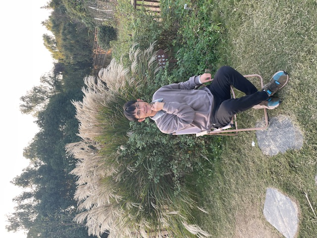

Hello, I'm glad you visited my blog! I'm Zhang Jian, from Suzhou, China.

I'm currently a freelancer, I take on online web development business, quoting $30/hour.

In my spare time, I contribute code to the open source project [Markdown Resume Blog](https://github.com/resumeblog/markdown-resume-blog).
This is a project I built myself, and it is the blog engine of the website you are visiting now.

In addition, I also built the website [LeetCoder.net](https://leetcoder.net) to teach programming algorithms.

I used to be addicted to playing video games, but I quit completely. If you want to know how I quit playing games, please follow the column on this site.

If you need my service, please contact me!

